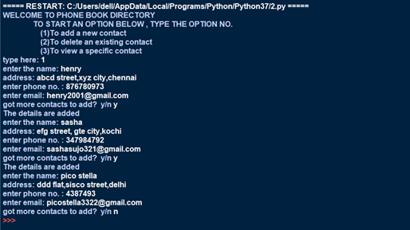
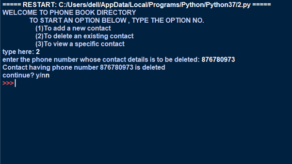
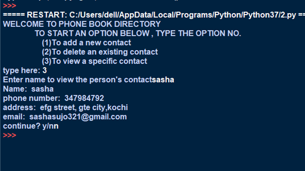
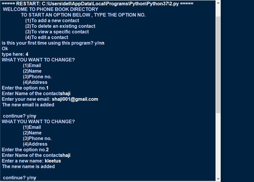
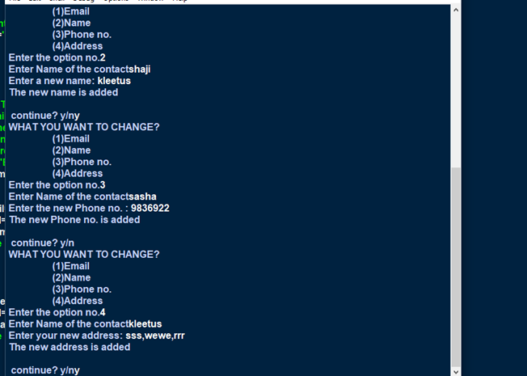

# 📒 Phone Book Directory

A simple **Phone Book Directory** implemented in Python with MySQL.  
This project allows users to create, view, edit, and delete contacts stored in a MySQL database.

---

## 🚀 Features
- Create a **Phone Book** database and store contact details:
  - Name
  - Phone Number
  - Email
  - Address
- Add multiple contacts to the directory.
- View a specific contact by providing the **name**.
- Delete a contact by providing the **phone number**.
- Edit contact details (email, name, phone number, or address).

---

## 🛠️ Tech Stack
- **Python 3**
- **MySQL Database**
- **mysql-connector-python** library

---

## 📂 Database Schema
Database: `PHONEBOOK`  
Table: `contents`

| Column   | Type          |
|----------|--------------|
| SLNO     | INT(2)       |
| phonenum | INT(10)      |
| name     | VARCHAR(20)  |
| address  | VARCHAR(100) |
| email    | VARCHAR(50)  |

---
## 📸 Output

### ➕ Adding New Contacts


### ❌ Deleting Existing Contact


### 👀 Viewing Contact Details


### ✏️ Editing Contact (Email, Name, Phone No., or Address)
  


---

## ⚙️ Setup & Installation

1. **Clone the repository**
   ```bash
   git clone https://github.com/yourusername/phone-book-directory.git
   cd phone-book-directory
